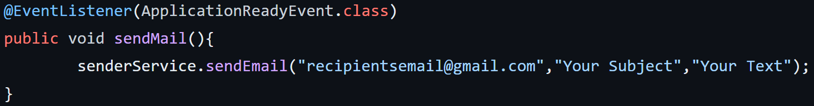

# simple-email-sender
A simple script on Spring Boot that performs the function of sending emails. 
I took it to a small service and use it in my projects if I need a mail service. 
The script can be expanded if additional functionality is needed. 
The code shows the minimum required for working mailing.

To test the service, replace the data in the file application.properties  (you will need to create an application password, if you use a Gmail mailbox, you can get information on how to do this [here](https://support.google.com/accounts/answer/185833?hl=en))   
And also change the data in the code section below to yours

  

